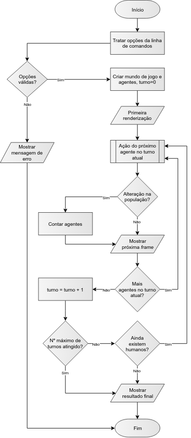

<!--
"Proposta de resolução do 2º Projeto de Linguagens de Programação I 2018/2019"
(c) by Nuno Fachada

All documentation and text (non-source code) in "Proposta de resolução do 2º
Projeto de Linguagens de Programação I 2018/2019" is licensed under a Creative
Commons Attribution-NonCommercial-ShareAlike 4.0 International License.

All the C# and images source code is licensed under the GNU General Public
License, version 3.

You should have received a copy of both licenses along with this
work. If not, see:

* <http://creativecommons.org/licenses/by-nc-sa/4.0/>
* <https://www.gnu.org/licenses/gpl-3.0.en.html>
-->

# Zombies vs Humanos

Proposta de resolução do [2º Projeto de LP1 2018/19][enunciado].

## Sumário

Este repositório contém uma proposta de resolução do
[2º Projeto de LP1 2018/19](https://github.com/VideojogosLusofona/lp1_2018_p2),
com os seguintes conteúdos:

* Código C# para implementação adequada da solução, considerando apenas a
  matéria lecionada em LP1 (uma vez que alguns aspetos poderiam ser melhorados
  com a matéria de LP2).
* Documentação gerada em [Doxygen], disponível [aqui][docs].
* Sugestão de bom uso de Git e [boas mensagens de *commit*][commits].
* Exemplo de como elaborar algumas partes do relatório, nomeadamente:
  * Como escrever a *Arquitetura da solução* e *Referências*.
  * Como fazer um diagrama UML de classes.
  * Como fazer um fluxograma.

## Arquitetura da solução

### Funcionamento do programa

O programa deve ser invocado com as opções da linha de comandos indicadas no
[enunciado][enunciado-opcoes], seguindo depois a sequência indicada no
fluxograma apresentado na Figura 1.

**Figura 1** - Fluxograma do programa (código fonte da figura
disponível [aqui](imgsource/fluxograma.drawio), tendo a mesma sido gerada em
[Draw.io]).

O programa começa por tratar as opções da linha de comandos, e se as mesmas
forem válidas é criado o mundo de simulação, bem como os agentes que o compõem,
caso contrário, o programa termina. Após a primeira renderização, entramos no
_game loop_, no qual cada iteração do ciclo corresponde a um turno do jogo.
Em cada turno, cada agente realiza a sua ação (mover ou infetar), e caso exista
uma alteração na população, é feita uma recontagem dos agentes. A visualização
é sempre atualizada após a ação de cada agente. O _game loop_ termina quando
não existirem mais humanos ou quando tiver sido atingido o número máximo de
turnos. O programa termina com uma mensagem indicando o resultado final do
jogo.

A nível do código, o programa tem início no método `Main()`, que se encontra na
classe [`Program`]. O `Main()` começa por criar uma instância de
[`ConsoleUserInterface`] (que representa a interface de utilizador),
disponibilizando-a globalmente numa propriedade estática chamada `UI` (em LP2
discutiremos o [*Singleton design pattern*], que é geralmente mais apropriado
para disponibilizar uma única instância globalmente). De seguida é invocado o
método [`Options.ParseArgs`], que trata as opções da linha de comandos e
devolve uma instância de [`Options`] que disponibiliza as opções já tratadas e
validadas sob a forma de propriedades. Se ocorrer um erro no tratamento das
opções o programa termina por aqui, caso contrário é criada uma nova instância
da classe [`Game`] e invocado o método `Play()` nessa mesma instância, dando
início ao jogo.

As relações entre [`Program`] e as instâncias de [`ConsoleUserInterface`],
[`Options`] e [`Game`] são mostradas no diagrama UML apresentado na Figura 2.
Como é possível observar nesta figura, a instância de UI é representada pela
interface [`IUserInterface`], o que permite usar UIs alternativas, como por
exemplo uma UI gráfica (GUI). As restantes classes, nomeadamente a classe
[`Game`], nunca têm conhecimento que se trata na realidade de uma instância de
[`ConsoleUserInterface`].

**Figura 2** - Diagrama UML de classes da solução (código fonte da figura
disponível [aqui](imgsource/uml.yuml), tendo a mesma sido gerada em [yUML]).
Para simplificação do diagrama são apenas mostradas as relações de dependência
mais importantes.

### Design de classes

A classe [`Game`] é uma das mais importantes neste projeto. É durante a sua
instanciação que é criado o mundo de simulação (instância de
[`IReadOnlyWorld`]), bem como dos agentes que o compõem. Esta classe é também
responsável pelo *game loop*, implementado no método `Play()`.

Como é possível observar na Figura 2, a classe [`Agent`] é central neste
projeto. A classe tem várias propriedades públicas que a definem,
nomeadamente: a) propriedade `Kind`, do tipo [`AgentKind`], enumeração que
define se o agente é zombie ou humano; b) propriedade `Movement`, do tipo
[`AgentMovement`], enumeração que indica se o agente é controlado pela IA ou
pelo jogador; e, c) propriedade `Pos`, do tipo [`Coord`], _struct_ que define a
posição do agente no mundo de simulação. A classe [`Agent`] possui também a
variável de instância privada `moveBehavior`, do tipo [`AbstractMovement`],
responsável por realizar o movimento do agente. Sendo [`AbstractMovement`] um
tipo abstrato, o movimento será realizado: a) pelo jogador, se a variável
for do tipo concreto [`PlayerMovement`]; ou, b) pela IA, se a variável for do
tipo concreto [`AIMovement`]. Naturalmente, tanto [`PlayerMovement`] como
[`AIMovement`] estendem [`AbstractMovement`], relação de herança bem visível na
Figura 2. O agente, ao invocar o método `WhereToMove()` da classe
[`AbstractMovement`] não sabe se o movimento vai ser feito pelo jogador ou pela
IA, pois isso depende do tipo concreto guardado na variável `moveBehavior`. É
uma situação clara de [polimorfismo]. É de realçar ainda que as instâncias de
[`AIMovement`] possuem uma referência ao género do agente inimigo (enumeração
[`AgentKind`]), uma vez que, para tomar uma decisão, precisam de saber quem são
os agentes inimigos.

A classe [`World`] representa o mundo de simulação, contendo uma referência a
cada um dos agentes existentes no mesmo. Por sua vez, os agentes, bem como as
classes [`Game`] e [`AbstractMovement`], também contêm uma referência ao mundo
de simulação. No entanto estas duas últimas fazem-no indiretamente através da
interface [`IReadOnlyWorld`], que a classe [`World`] implementa. Como o nome
indica, a interface [`IReadOnlyWorld`] apenas define funcionalidade para
leitura do mundo (por exemplo, para saber o que existe em dada célula do mundo),
não permitindo alteração dos conteúdos do mesmo. Uma vez que tanto [`Game`]
como [`AbstractMovement`] não precisam de alterar o mundo, o mesmo fica
protegido de alterações indevidas quando visto como um [`IReadOnlyWorld`]. A
classe [`Agent`] é a única que pode alterar o mundo, e dessa forma possui uma
referência direta ao mesmo.

### Estruturas de dados e algoritmos utilizados

_em construção_

<!--
* Porque Coord e Options sao structs
* Além de colocar os agentes no mundo de simulação, a instância de [`Game`]
  mantém também uma referência interna aos mesmos num _array_, não sendo
  necessário uma lista uma vez que o número total de agentes nunca muda
  ao longo do jogo.
* Fisher–Yates shuffle
* Dicionário de stats
* Array bi-dimensional
* Fila (para mensagens)
* Opções e algoritmo para tratamento de opções
* Algoritmo de IA dos agentes
* Cache da visualização
-->

## Referências

* [Fisher–Yates shuffle - Wikipedia](https://en.wikipedia.org/wiki/Fisher%E2%80%93Yates_shuffle)
* [Polymorphism (C# Programming Guide) - Microsoft Docs](https://docs.microsoft.com/en-us/dotnet/csharp/programming-guide/classes-and-structs/polymorphism)
* [Singleton Design Pattern in C# - Dot Net Tutorials](https://dotnettutorials.net/lesson/singleton-design-pattern/)
* [The Strategy Design Pattern in C#](https://exceptionnotfound.net/strategy-the-daily-design-pattern/)
* _em construção_

## Metadados

* Autor: [Nuno Fachada]
* Curso:  [Licenciatura em Videojogos][lamv]
* Instituição: [Universidade Lusófona de Humanidades e Tecnologias][ULHT]

## Licenças e atribuições

* O código é disponibilizado através da licença [GPLv3].
* A documentação é disponibilizada através da licença [CC BY-NC-SA 4.0][CCBYNC].
* O [logótipo] do projeto é baseado nos ícones desenhados por [Freepik]
  disponíveis em <https://www.flaticon.com>.

[enunciado]:https://github.com/VideojogosLusofona/lp1_2018_p2
[enunciado-opcoes]:https://github.com/VideojogosLusofona/lp1_2018_p2#invoca%C3%A7%C3%A3o-do-programa
[lamv]:https://www.ulusofona.pt/licenciatura/videojogos
[Nuno Fachada]:https://github.com/fakenmc
[ULHT]:https://www.ulusofona.pt/
[GPLv3]:http://www.gnu.org/licenses/gpl.html
[CCBYNC]:https://creativecommons.org/licenses/by-nc-sa/4.0/
[logótipo]:logo.png
[Freepik]:https://www.freepik.com/home
[yUML]:https://yuml.me/
[Draw.io]:https://www.draw.io/
[Doxygen]:http://www.doxygen.nl/index.html
[docs]:https://videojogoslusofona.github.io/lp1_2018_p2_solucao/
[commits]:https://github.com/VideojogosLusofona/lp1_2018_p2_solucao/commits/master
[`Program`]:https://github.com/VideojogosLusofona/lp1_2018_p2_solucao/blob/master/ZombiesVsHumans/Program.cs
[`ConsoleUserInterface`]:https://github.com/VideojogosLusofona/lp1_2018_p2_solucao/blob/master/ZombiesVsHumans/ConsoleUserInterface.cs
[*Singleton design pattern*]:https://dotnettutorials.net/lesson/singleton-design-pattern/
[`Options.ParseArgs`]:https://github.com/VideojogosLusofona/lp1_2018_p2_solucao/blob/master/ZombiesVsHumans/Options.cs#L175
[`Options`]:https://github.com/VideojogosLusofona/lp1_2018_p2_solucao/blob/master/ZombiesVsHumans/Options.cs
[`Game`]:https://github.com/VideojogosLusofona/lp1_2018_p2_solucao/blob/master/ZombiesVsHumans/Game.cs
[`IUserInterface`]:https://github.com/VideojogosLusofona/lp1_2018_p2_solucao/blob/master/ZombiesVsHumans/IUserInterface.cs
[`Agent`]:https://github.com/VideojogosLusofona/lp1_2018_p2_solucao/blob/master/ZombiesVsHumans/Agent.cs
[`AgentKind`]:https://github.com/VideojogosLusofona/lp1_2018_p2_solucao/blob/master/ZombiesVsHumans/AgentKind.cs
[`AgentMovement`]:https://github.com/VideojogosLusofona/lp1_2018_p2_solucao/blob/master/ZombiesVsHumans/AgentMovement.cs
[`Coord`]:https://github.com/VideojogosLusofona/lp1_2018_p2_solucao/blob/master/ZombiesVsHumans/Coord.cs
[`IReadOnlyWorld`]:https://github.com/VideojogosLusofona/lp1_2018_p2_solucao/blob/master/ZombiesVsHumans/IReadOnlyWorld.cs
[`AbstractMovement`]:https://github.com/VideojogosLusofona/lp1_2018_p2_solucao/blob/master/ZombiesVsHumans/AbstractMovement.cs
[`PlayerMovement`]:https://github.com/VideojogosLusofona/lp1_2018_p2_solucao/blob/master/ZombiesVsHumans/PlayerMovement.cs
[`AIMovement`]:https://github.com/VideojogosLusofona/lp1_2018_p2_solucao/blob/master/ZombiesVsHumans/AIMovement.cs
[`World`]:https://github.com/VideojogosLusofona/lp1_2018_p2_solucao/blob/master/ZombiesVsHumans/World.cs
[polimorfismo]:https://docs.microsoft.com/en-us/dotnet/csharp/programming-guide/classes-and-structs/polymorphism
