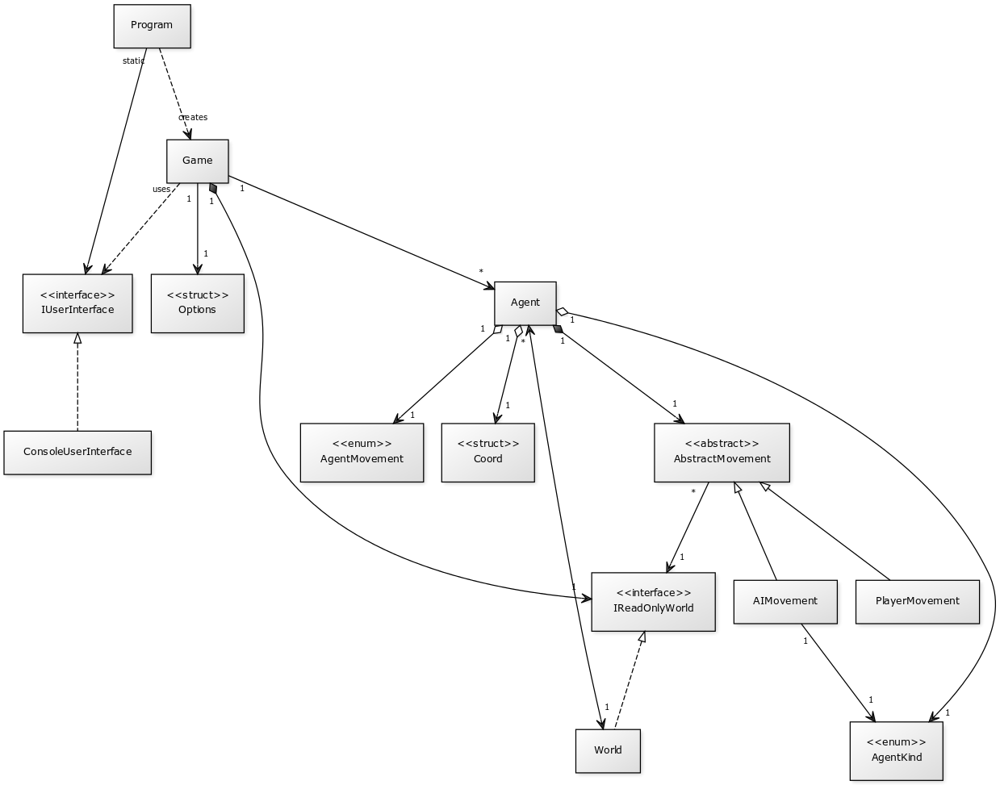

<!--
"Proposta de resolução do 2º Projeto de Linguagens de Programação I 2018/2019"
(c) by Nuno Fachada

All documentation and text (non-source code) in "Proposta de resolução do 2º
Projeto de Linguagens de Programação I 2018/2019" is licensed under a Creative
Commons Attribution-NonCommercial-ShareAlike 4.0 International License.

All the C# and images source code is licensed under the GNU General Public
License, version 3.

You should have received a copy of both licenses along with this
work. If not, see:

* <http://creativecommons.org/licenses/by-nc-sa/4.0/>
* <https://www.gnu.org/licenses/gpl-3.0.en.html>
-->

# Zombies vs Humanos

Proposta de resolução do [2º Projeto de LP1 2018/19][enunciado].

## Sumário

Este repositório contém uma proposta de resolução do
[2º Projeto de LP1 2018/19](https://github.com/VideojogosLusofona/lp1_2018_p2),
com os seguintes conteúdos:

* Código C# para implementação adequada da solução, considerando apenas a
  matéria lecionada em LP1 (uma vez que alguns aspetos poderiam ser melhorados
  com a matéria de LP2).
* Documentação gerada em [Doxygen], disponível [aqui][docs].
* Sugestão de bom uso de Git e [boas mensagens de *commit*][commits].
* Exemplo de como elaborar algumas partes do relatório, nomeadamente:
  * Como escrever a *Arquitetura da solução* e *Referências*.
  * Como fazer um diagrama UML de classes.
  * Como fazer um fluxograma.

## Arquitetura da solução

### Funcionamento do programa

O programa deve ser invocado com as opções da linha de comandos indicadas no
[enunciado][enunciado-opcoes], seguindo depois a sequência indicada no
fluxograma apresentado na Figura 1.

**Figura 1** - Fluxograma do programa (código fonte da figura
disponível [aqui](imgsource/fluxograma.drawio), tendo a mesma sido gerada em
[Draw.io]).

O programa começa por tratar as opções da linha de comandos, e se as mesmas
forem válidas é criado o mundo de simulação, bem como os agentes que o compõem,
caso contrário, o programa termina. Após a primeira renderização, entramos no
_game loop_, no qual cada iteração do ciclo corresponde a um turno do jogo.
Em cada turno, cada agente realiza a sua ação (mover ou infetar), e caso exista
uma alteração na população, é feita uma recontagem dos agentes. A visualização
é sempre atualizada após a ação de cada agente. O _game loop_ termina quando
não existirem mais humanos ou quando tiver sido atingido o número máximo de
turnos. O programa termina com uma mensagem indicando o resultado final do
jogo.

A nível do código, o programa tem início no método `Main()`, que se encontra na
classe [`Program`]. O `Main()` começa por criar uma instância de
[`ConsoleUserInterface`] (que representa a interface de utilizador),
disponibilizando-a globalmente numa propriedade estática chamada `UI` (em LP2
discutiremos o [*Singleton design pattern*], que é geralmente mais apropriado
para disponibilizar uma única instância globalmente). De seguida é invocado o
método [`Options.ParseArgs`], que trata as opções da linha de comandos e
devolve uma instância de [`Options`] que disponibiliza as opções já tratadas e
validadas sob a forma de propriedades. Se ocorrer um erro no tratamento das
opções o programa termina por aqui, caso contrário é criada uma nova instância
da classe [`Game`] e invocado o método `Play()` nessa mesma instância, dando
início ao jogo.

As relações entre [`Program`] e as instâncias de [`ConsoleUserInterface`],
[`Options`] e [`Game`] são mostradas no diagrama UML apresentado na Figura 2.
Como é possível observar nesta figura, a instância de UI é representada pela
interface [`IUserInterface`], o que permite usar UIs alternativas, como por
exemplo uma UI gráfica (GUI). As restantes classes, nomeadamente a classe
[`Game`], nunca têm conhecimento que se trata na realidade de uma instância de
[`ConsoleUserInterface`].

**Figura 2** - Diagrama UML de classes da solução (código fonte da figura
disponível [aqui](imgsource/uml.yuml), tendo a mesma sido gerada em [yUML]).
Para simplificação do diagrama são apenas mostradas as relações de dependência
mais importantes.

### Design de classes

#### Responsabilidades e relações entre as principais classes e tipos

A classe [`Game`] é uma das mais importantes neste projeto. É durante a sua
instanciação que é criado o mundo de simulação (instância de
[`IReadOnlyWorld`]), bem como dos agentes que o compõem. Esta classe é também
responsável pelo *game loop*, implementado no método `Play()`.

Como é possível observar na Figura 2, a classe [`Agent`] é central neste
projeto. A classe tem várias propriedades públicas que a definem,
nomeadamente: a) propriedade `Kind`, do tipo [`AgentKind`], enumeração que
define se o agente é zombie ou humano; b) propriedade `Movement`, do tipo
[`AgentMovement`], enumeração que indica se o agente é controlado pela IA ou
pelo jogador; e, c) propriedade `Pos`, do tipo [`Coord`], _struct_ que define a
posição do agente no mundo de simulação. A classe [`Agent`] possui também a
variável de instância privada `moveBehavior`, do tipo [`AbstractMovement`],
responsável por realizar o movimento do agente. Sendo [`AbstractMovement`] um
tipo abstrato, o movimento será realizado: a) pelo jogador, se a variável
for do tipo concreto [`PlayerMovement`]; ou, b) pela IA, se a variável for do
tipo concreto [`AIMovement`]. Naturalmente, tanto [`PlayerMovement`] como
[`AIMovement`] estendem [`AbstractMovement`], relação de herança bem visível na
Figura 2. O agente, ao invocar o método `WhereToMove()` da classe
[`AbstractMovement`] não sabe se o movimento vai ser feito pelo jogador ou pela
IA, pois isso depende do tipo concreto guardado na variável `moveBehavior`. É
uma situação clara de [polimorfismo]. É de realçar ainda que as instâncias de
[`AIMovement`] possuem uma referência ao género do agente inimigo (enumeração
[`AgentKind`]), uma vez que, para tomar uma decisão, precisam de saber quem são
os agentes inimigos.

A classe [`World`] representa o mundo de simulação, contendo uma referência a
cada um dos agentes existentes no mesmo. Por sua vez, os agentes, bem como as
classes [`Game`] e [`AbstractMovement`], também contêm uma referência ao mundo
de simulação. No entanto estas duas últimas fazem-no indiretamente através da
interface [`IReadOnlyWorld`], que a classe [`World`] implementa. Como o nome
indica, a interface [`IReadOnlyWorld`] apenas define funcionalidade para
leitura do mundo (por exemplo, para saber o que existe em dada célula do mundo),
não permitindo alteração dos conteúdos do mesmo. Uma vez que tanto [`Game`]
como [`AbstractMovement`] não precisam de alterar o mundo, o mesmo fica
protegido de alterações indevidas quando visto como um [`IReadOnlyWorld`]. A
classe [`Agent`] é a única que pode alterar o mundo, e dessa forma possui uma
referência direta ao mesmo.

#### Classes vs *structs* vs enumerações

A maioria dos tipos criados neste projeto são classes, com a exceção das
*structs* [`Coord`] e [`Options`]. No caso da primeira, uma vez que se trata de
um tipo muito simples e imutável (serve apenas para guardar uma coordenada *x*,
*y*), optou-se por tornar este tipo uma *struct*.

O caso de [`Options`] não é tão claro. Trata-se essencialmente de um tipo que
serve como contentor de opções validadas, imutável após a sua instanciação, e
nesse sentido encaixa bem como uma *struct*. No entanto contém 11 campos, o que
torna mais pesada a sua cópia por valor. Uma vez que isto acontece numa única
ocasião – quando a instância de `Options` é passada ao construtor de `Game` –
optou-se por manter o tipo `Options` como uma *struct*. Seria perfeitamente
válido ter usado uma classe neste caso.

Os tipos [`AgentKind`], [`AgentMovement`] e [`Direction`] são naturalmente
enumerações pois representam um número limitado de valores possíveis, por
exemplo _Zombie_ ou _Humano_ no caso de [`AgentKind`].

### Estruturas de dados e algoritmos utilizados

#### Onde estão os agentes?

Os agentes, representados por instâncias da classe [`Agent`], encontram-se
referenciados em duas estruturas de dados distintas:

1. Num _array_ na classe [`Game`] (variável de instância `agents`).
2. Num _array_ bidimensional na classe [`World`] (variável de instância
   `world`).

No primeiro caso, uma vez que o número total de agentes nunca muda ao longo do
jogo, podemos usar um simples _array_ de tamanho fixo, em vez de uma lista por
exemplo, obedecendo assim ao princípio [KISS]. É necessário que a classe
[`Game`] contenha as referência dos agentes por duas razões: i) para podermos
embaralhá-los antes de cada turno (para este efeito usamos o algoritmo de
[Fisher–Yates][FY], implementado no método `Shuffle()`); e, ii) para podermos
contar o número de cada género de agentes existentes no jogo (ação que é
realizada no método `ReCountAgents()` usando parâmetros `out`).

No segundo caso, simplifica bastante o projeto se a classe [`World`] conseguir
rapidamente determinar se existem ou não agentes, bem como o seu género, em
cada posição do mundo de simulação. Para este efeito usa-se um _array_
bidimensional de agentes, do tamanho do mundo. Cada posição deste _array_ ou
tem uma referência a um agente ou tem o valor `null`, sendo este último uma
indicação de que a posição não contém nenhum agente.

#### Mundo toroidal com vizinhança de Moore

O mundo de simulação tem a particularidade de ser toroidal ("dá a volta") e ter
uma vizinhança de Moore. Uma vez que estas são características do mundo,
faz sentido que as mesmas estejam programadas na classe [`World`]. Métodos
desta classe que lidam com coordenadas antes de mais tratam essas coordenadas
com o método privado `Normalize()`. Se as coordenadas forem
válidas, o método `Normalize()` não faz nada; por outro lado, se as coordenadas
não corresponderem a uma posição no mundo (por exemplo, se já deviam ter "dado
a volta"), o método `Normalize()` retifica as mesmas, fazendo-as "dar a volta"
corretamente. Desta forma, todos os métodos da classe [`World`] garantem que
estão a lidar com coordenadas válidas num mundo toroidal.

O método `VectorBetween()` aceita duas coordenadas, normaliza-as, e devolve um
vetor que parte da primeira coordenada e termina na segunda, garantido que esse
vetor representa o caminho mais curto entre essas duas coordenadas num mundo
toroidal.

Os dois _overloads_ do método `GetNeighbor()` devolvem a coordenada do vizinho
de uma dada célula, aceitando ou uma direção (enumeração [`Direction`]) ou um
vetor (_struct_ [`Coord`]) que indica em que lado está o vizinho.

Estes métodos simplificam bastante o restante código do projeto, que pode
perfeitamente ignorar os detalhes de como implementar um mundo toroidal com
vizinhança de Moore, uma vez que tais detalhes estão encapsulados na
classe [`World`].

#### Movimento automático dos agentes

O movimento automático dos agentes está implementado no método `WhereToMove()`
da classe [`AIMovement`]. Basicamente trata-se de um triplo ciclo `for`, em que
o ciclo externo percorre os raios de 1 até ao raio máximo (igual a metade da
maior dimensão do mundo, _x_ ou _y_). Em cada iteração do ciclo externo o valor
do raio é dado na variável `r`. O ciclo `for` intermédio percorre, de `-r` a
`r`, a distância vertical `dy` entre o agente que se quer mover e as possíveis
células destino. Por sua vez, o ciclo `for` interno percorre também essa
distância, mas na horizontal (`dx`).

Dentro do ciclo interno, tendo a coordenada do agente, bem como as distâncias
vertical e horizontal até à possível célula destino, obtemos a coordenada
`x`, `y` da mesma da seguinte forma (pseudo-código):

* `x = agent.X + dx`
* `y = agent.Y + dy`

Uma vez obtida essa coordenada, verificamos se a respetiva célula contém um
agente e se esse agente é um inimigo do agente que se quer mover. Em caso
afirmativo obtemos um vetor (ver secção anterior) entre a posição do agente que
se quer mover e a posição do inimigo, colocando a variável `foundEnemy` a
`true`, provocando o fim do triplo `for`. Caso contrário, continua a procura
por um agente inimigo.

Uma vez terminado o triplo ciclo `for`, e caso tenha sido encontrado um
inimigo, o método `WhereToMove()` devolve a posição vizinha na direção desse
inimigo, usando para tal o método `GetNeighbor()` da classe [`World`], tal como
descrito na secção anterior. Caso contrário devolve a posição do agente que se
quer mover, o que resulta num não-movimento por parte desse agente.

#### Fila de mensagens para o utilizador

A interface [`IUserInterface`] define o método `RenderMessage()`, pelo que as
classes que a implementam são obrigadas a ter este método. Segundo a
documentação da interface, este método "*apresenta uma mensagem ao utilizador*",
no entanto a forma como tal é feito fica a cargo das classes concretas que
implementam a interface. Neste caso, a classe [`ConsoleUserInterface`] é a
única fazê-lo. A forma como esta classe lida com as mensagens é a seguinte.
Em particular, quando o método `RenderMessage()` recebe uma mensagem, são
realizadas as seguintes ações:

* A mensagem é tratada de modo a ter um tamanho fixo, adicionando espaços no
  fim ou removendo carateres a mais, conforme o caso.
* A mensagem tratada é colocada numa fila (variável de instância do tipo
  [`Queue<string>`]). A fila tem um tamanho máximo, e se o número de mensagens
  exceder esse máximo, a mensagem mais antiga é descartada.
* É construída uma _string_ contendo todas as mensagens, exceto a última (cada
  mensagem separada por uma nova linha, `\n`).
* O cursor é posicionado no local onde é suposto serem impressas as mensagens,
  e a _string_ contendo as mensagens (exceto a última) é impressa de uma só
  vez, num único `Console.Write()`, com cores específicas de fundo e primeiro
  plano.
* É impressa a última mensagem, com uma cor diferente de fundo e primeiro
  plano, diferenciando-se assim das restantes mensagens.

Isto provoca um efeito de _scrolling_, semelhante aos _logs_ de vários jogos. É
de realçar que outra classe que implemente [`IUserInterface`] pode ter a sua
própria forma específica de mostrar as mensagens ao utilizador.

#### Visualização do mundo de simulação usando uma *cache*

A renderização do mundo é realizada pelo método `RenderWorld()` da classe
[`ConsoleUserInterface`], também definido na interface [`IUserInterface`]. No
entanto a impressão de carateres na consola, com diferentes cores, pode ser
um pouco lenta. Para minimizar essa situação, entre cada nova renderização
podemos reimprimir apenas as posições em que ocorreram alterações, deixando o
resto da visualização tal como está.

Existem várias formas de alcançar este objetivo. Neste projeto optou-se por
usar uma *cache* de visualização que contém o estado anterior do mundo. Embora
o termo *cache* esteja mais relacionado com pequenas memórias RAM muito rápidas,
tipicamente associadas ao microprocessador, de um modo mais geral podemos
considerar uma *cache* como qualquer memória intermédia que sirva o propósito
de acelerar uma computação.

Neste caso a *cache* de visualização é uma variável de instância da classe
[`ConsoleUserInterface`], do tipo *array* bidimensional de *strings*, com
dimensão igual à do mundo de simulação. Quando o mundo é desenhado no ecrã pela
primeira vez no ecrã, é guardada em cada posição da *cache* uma *string*
representativa do conteúdo de cada célula do mundo. Nas renderizações
seguintes, o conteúdo de cada célula do mundo é comparado com a respetiva
*string* na *cache*. Se o conteúdo não tiver sido alterado, nada é desenhado,
ficando no ecrã o que já lá estava antes. Se o conteúdo for diferente, então a
respetiva célula é redesenhada. Desta forma a visualização fica bastante mais
fluida.

#### Tratamento de opções na linha de comandos

<!--
* Opções e algoritmo para tratamento de opções
-->
_em construção_

### Personalização da visualização e andamento do jogo

_em construção_

## Referências

* [Fisher–Yates shuffle - Wikipedia][FY]
* [KISS principle - Wikipedia][KISS]
* [Polymorphism (C# Programming Guide) - Microsoft Docs](https://docs.microsoft.com/en-us/dotnet/csharp/programming-guide/classes-and-structs/polymorphism)
* [Singleton Design Pattern in C# - Dot Net Tutorials](https://dotnettutorials.net/lesson/singleton-design-pattern/)
* [The Strategy Design Pattern in C# - Exception Not Found](https://exceptionnotfound.net/strategy-the-daily-design-pattern/)
* [Moore neighborhood - Wikipedia](https://en.wikipedia.org/wiki/Moore_neighborhood)
* [When to use struct? - StackOverflow](https://stackoverflow.com/questions/521298/when-to-use-struct)

## Metadados

* Autor: [Nuno Fachada]
* Curso:  [Licenciatura em Videojogos][lamv]
* Instituição: [Universidade Lusófona de Humanidades e Tecnologias][ULHT]

## Licenças e atribuições

* O código é disponibilizado através da licença [GPLv3].
* A documentação é disponibilizada através da licença [CC BY-NC-SA 4.0][CCBYNC].
* O [logótipo] do projeto é baseado nos ícones desenhados por [Freepik]
  disponíveis em <https://www.flaticon.com>.

[enunciado]:https://github.com/VideojogosLusofona/lp1_2018_p2
[enunciado-opcoes]:https://github.com/VideojogosLusofona/lp1_2018_p2#invoca%C3%A7%C3%A3o-do-programa
[lamv]:https://www.ulusofona.pt/licenciatura/videojogos
[Nuno Fachada]:https://github.com/fakenmc
[ULHT]:https://www.ulusofona.pt/
[GPLv3]:http://www.gnu.org/licenses/gpl.html
[CCBYNC]:https://creativecommons.org/licenses/by-nc-sa/4.0/
[logótipo]:logo.png
[Freepik]:https://www.freepik.com/home
[yUML]:https://yuml.me/
[Draw.io]:https://www.draw.io/
[Doxygen]:http://www.doxygen.nl/index.html
[docs]:https://videojogoslusofona.github.io/lp1_2018_p2_solucao/
[commits]:https://github.com/VideojogosLusofona/lp1_2018_p2_solucao/commits/master
[`Program`]:https://github.com/VideojogosLusofona/lp1_2018_p2_solucao/blob/master/ZombiesVsHumans/Program.cs
[`ConsoleUserInterface`]:https://github.com/VideojogosLusofona/lp1_2018_p2_solucao/blob/master/ZombiesVsHumans/ConsoleUserInterface.cs
[*Singleton design pattern*]:https://dotnettutorials.net/lesson/singleton-design-pattern/
[`Options.ParseArgs`]:https://github.com/VideojogosLusofona/lp1_2018_p2_solucao/blob/master/ZombiesVsHumans/Options.cs#L175
[`Options`]:https://github.com/VideojogosLusofona/lp1_2018_p2_solucao/blob/master/ZombiesVsHumans/Options.cs
[`Game`]:https://github.com/VideojogosLusofona/lp1_2018_p2_solucao/blob/master/ZombiesVsHumans/Game.cs
[`IUserInterface`]:https://github.com/VideojogosLusofona/lp1_2018_p2_solucao/blob/master/ZombiesVsHumans/IUserInterface.cs
[`Agent`]:https://github.com/VideojogosLusofona/lp1_2018_p2_solucao/blob/master/ZombiesVsHumans/Agent.cs
[`AgentKind`]:https://github.com/VideojogosLusofona/lp1_2018_p2_solucao/blob/master/ZombiesVsHumans/AgentKind.cs
[`AgentMovement`]:https://github.com/VideojogosLusofona/lp1_2018_p2_solucao/blob/master/ZombiesVsHumans/AgentMovement.cs
[`Coord`]:https://github.com/VideojogosLusofona/lp1_2018_p2_solucao/blob/master/ZombiesVsHumans/Coord.cs
[`IReadOnlyWorld`]:https://github.com/VideojogosLusofona/lp1_2018_p2_solucao/blob/master/ZombiesVsHumans/IReadOnlyWorld.cs
[`AbstractMovement`]:https://github.com/VideojogosLusofona/lp1_2018_p2_solucao/blob/master/ZombiesVsHumans/AbstractMovement.cs
[`PlayerMovement`]:https://github.com/VideojogosLusofona/lp1_2018_p2_solucao/blob/master/ZombiesVsHumans/PlayerMovement.cs
[`AIMovement`]:https://github.com/VideojogosLusofona/lp1_2018_p2_solucao/blob/master/ZombiesVsHumans/AIMovement.cs
[`World`]:https://github.com/VideojogosLusofona/lp1_2018_p2_solucao/blob/master/ZombiesVsHumans/World.cs
[polimorfismo]:https://docs.microsoft.com/en-us/dotnet/csharp/programming-guide/classes-and-structs/polymorphism
[`Direction`]:https://github.com/VideojogosLusofona/lp1_2018_p2_solucao/blob/master/ZombiesVsHumans/Direction.cs
[KISS]:https://en.wikipedia.org/wiki/KISS_principle
[FY]:https://en.wikipedia.org/wiki/Fisher%E2%80%93Yates_shuffle
[`Queue<string>`]:https://docs.microsoft.com/en-us/dotnet/api/system.collections.generic.queue-1